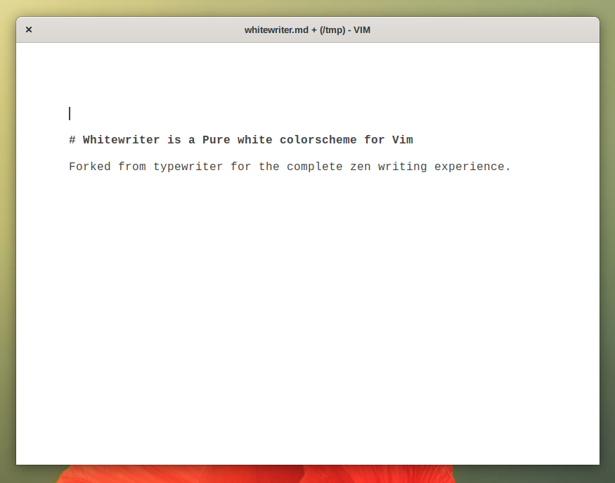

# whitewriter [▎](https://github.com/mipmip/vim-whitewriter)

Whitewriter is a fork of Typewriter but with a pure white background.

A minimalistic vim and gvim colorscheme inspired by the great iA Writer editor.
This repo contains the light (whitewriter.vim) and dark (whitewriter-dark.vim)
versions.

NOTE: whitewriter can only be used in terminals with true color support. E.g.
[st](https://st.suckless.org/)

## Installation

- You can use your vim plugin manager of choice
- Or manually
- Clone this repo.
- Copy `colors/*.vim` to `~/.vim/colors/`

## Usage

To enable this colorscheme, set in your .vimrc file:

```vim
colorscheme whitewriter
" or whitewriter-night
```

You might need some extra configuration for true color support:

```vim
set termguicolors
let &t_8f = "\<Esc>[38;2;%lu;%lu;%lum"
let &t_8b = "\<Esc>[48;2;%lu;%lu;%lum"
```

## Extras

If you want a closer feel to iA Writer install

- [goyo.vim](https://github.com/junegunn/goyo.vim) for focus mode.

### Screenshots



## Thanks

Whitewriter is forked from [Typewriter](https://github.com/logico/typewriter-vim)

Whitewriter is based/inspired by these projects

- [iA Writer](https://ia.net/writer/)
- [Vim colorschemes](https://github.com/flazz/vim-colorschemes)
